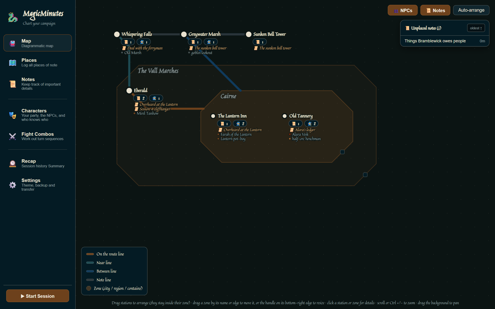
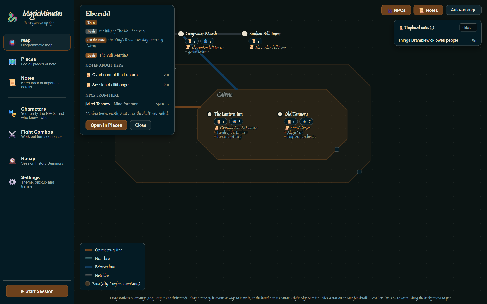
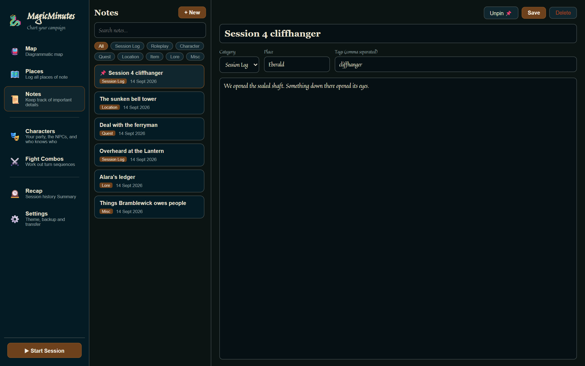
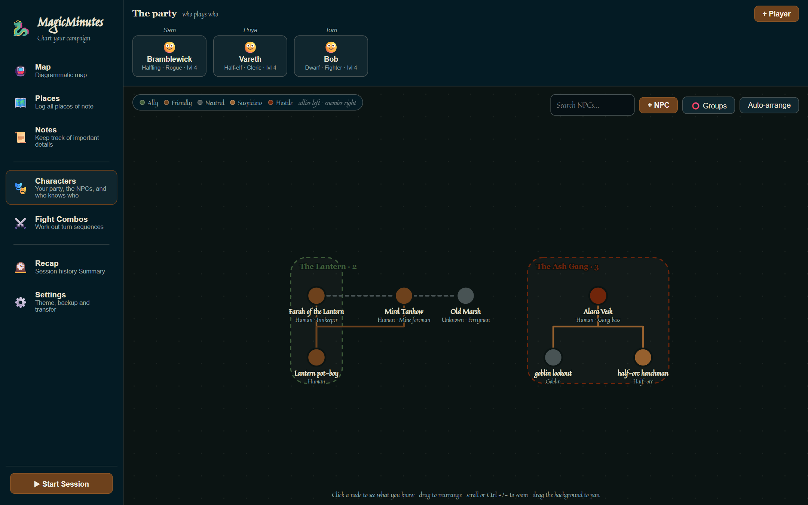
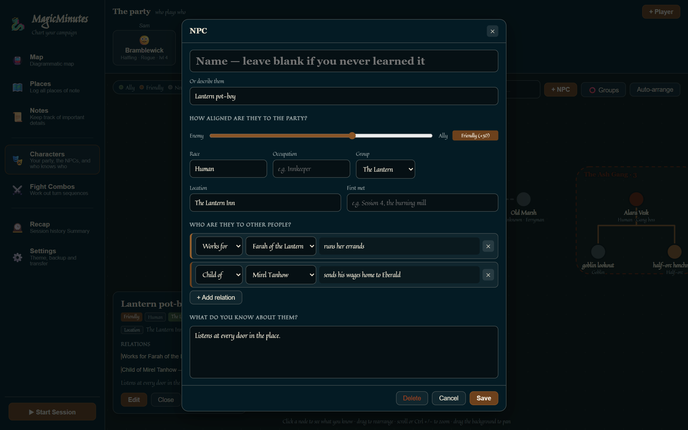
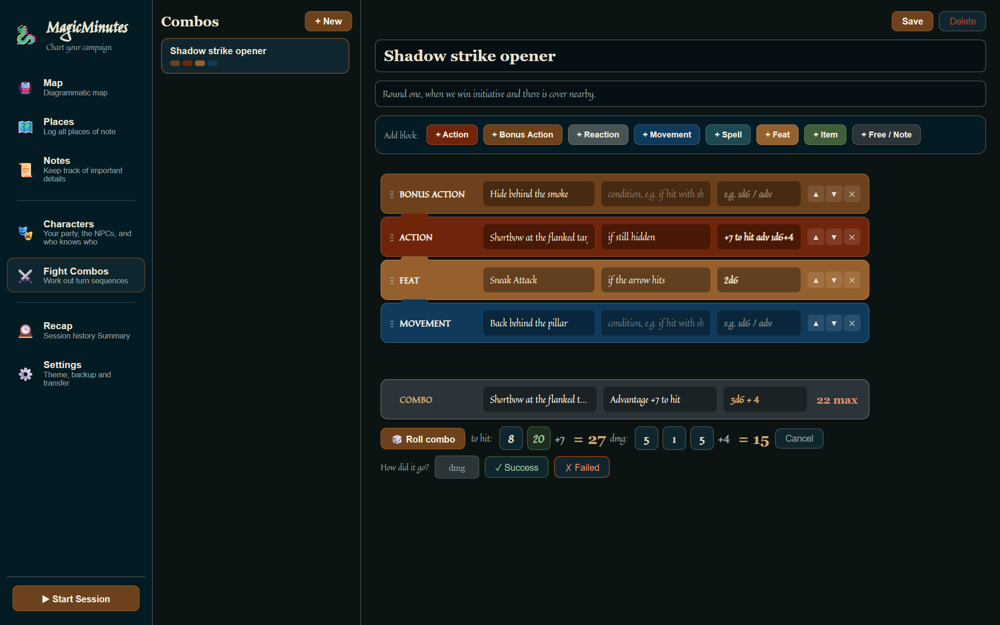
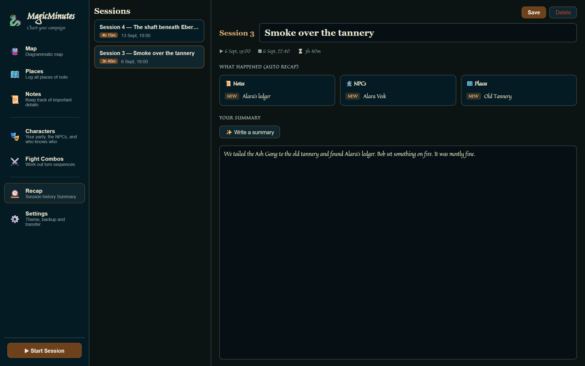
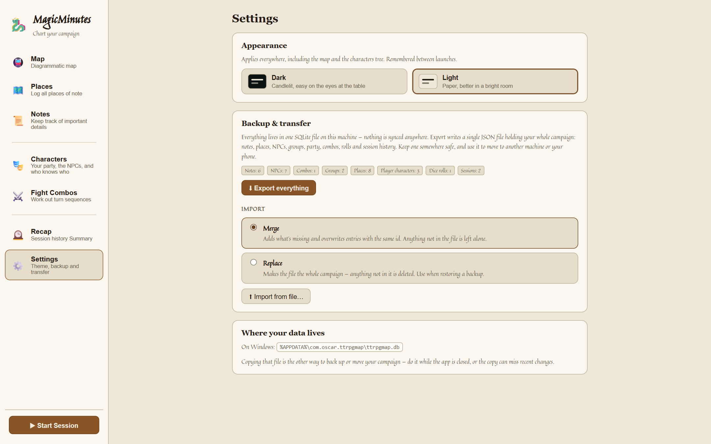

# MagicMinutes

**A campaign notebook for tabletop RPG players.** Keep track of the places you've been,
the people you've met, what happened each session, and your best combat moves — all in
one small desktop app that works offline and keeps everything on your own computer.



---

## Why you might want it

Between sessions it's easy to forget the name of the innkeeper who owed you a favour, which
town was north of which, or what that clue in session 3 actually was. MagicMinutes is built
for the player sitting at the table with a pen, not the game master.

- **Your notes draw the map for you.** Write "on the King's Road, north of Cairne" on a place
  and a line appears between the two. Mention a place in a note and it's pinned there. No
  drawing tools, no dragging lines around.
- **See who's who at a glance.** A family-tree view of every NPC: who works for whom, which
  gang they belong to, and whether they're on your side. Nameless NPCs are fine too —
  "half-orc henchman" works as well as a name.
- **Remember which friend plays which character.** The party is shown with the real player
  above each character.
- **Sessions write their own recap.** Press Start Session, play, press End Session, and you
  get a list of everything you added or changed that night.
- **Plan your turn before it comes round.** Build combos out of actions, bonus actions,
  movement and spells, then roll the whole thing in one click.
- **Private and offline.** No account, no sign-up, no cloud. Your campaign is one file on
  your computer, and you can export it to a single backup file whenever you like.
- **Tiny.** The installer is about 3.5 MB.

It isn't tied to any particular game system. The combat builder uses terms familiar from
d20 games (action, bonus action, reaction, advantage), but everything else — places, notes,
characters, sessions — works for any campaign.

---

## Download and install

**Windows 10 / 11**

1. Go to the [**Releases page**](https://github.com/OscarHealyATU/MagicMinutes/releases/latest)
   and download `MagicMinutes_0.1.0_x64-setup.exe`.
2. Run it. It installs just for you (no administrator password needed) and adds a
   **MagicMinutes** shortcut to your desktop and Start menu.
3. **Windows may warn you** with a blue "Windows protected your PC" screen. That's because
   the installer isn't signed with a paid certificate, not because anything is wrong.
   Click **More info → Run anyway**.

The app uses Microsoft Edge WebView2, which is already part of Windows 10 and 11. If it's
somehow missing, the installer fetches it for you.

**Mac, Linux and Android** aren't released yet. The app is built with
[Tauri](https://tauri.app), which supports all of them, so you can build it yourself — see
[docs/DEVELOPMENT.md](docs/DEVELOPMENT.md).

---

## Quick start

1. **Add a few places** in **Places**. Give each one a *location block* that mentions
   another place, like *Between: Cairne and the Sunken Bell Tower*.
2. **Open the Map.** Your places are now stations joined by lines.
3. **Write notes** in **Notes** during the session. Put a place name in the note and it
   shows up on that station.
4. **Add your party and the NPCs** you meet in **Characters**.
5. Next session, press **▶ Start Session** at the bottom of the sidebar first, and
   **⏹ End Session** when you finish. **Recap** shows everything that changed.

The rest of this page explains each part in detail.

---

## The Map 🚇

The map is drawn automatically from your **Places**. It looks like a transit map on purpose:
it shows how places connect, not exact distances.



### What the symbols mean

| On the map | What it means |
|---|---|
| **Small dot** with a name | A place (a "station"). |
| **Larger dot with a thick ring** | An *interchange*: a place on two or more lines. |
| **Coloured line** between places | A connection you wrote in a place's location blocks. The colour is the block type: **On the route**, **Near**, **Between**, **Direction** or **Note**. The legend in the bottom-left lists the ones your map uses. |
| **Tinted octagon** with a name at the top | A *zone*: a place that other places sit inside — a region, a city, a castle. Made with **Inside** or **Contains** blocks. Zones nest, and deeper zones are shaded darker. A zone is always a regular octagon: it grows evenly to fit what's inside it. |
| **Joined octagons** | A zone holding one, two or three smaller zones. Each smaller zone sits in the middle of its own octagon, in alphabetical order: side by side for two, an L shape for three. The zone's own places sit in the band around them. With four or more smaller zones it's one big octagon again. |
| 📜 **3** badge | Three notes mention this place. |
| 🧙 **2** badge | Two NPCs have this place in their **Location**. |
| *📜 Italic titles* under a place | A preview of those notes (up to four). |
| **●** coloured dot and a name | A preview of those NPCs. The dot's colour shows how friendly they are (see [Characters](#characters-)). |
| **+2 more…** | More notes or NPCs than fit. Click the place to see them all. |
| Small square on a zone's bottom-right edge | Drag it to scale the zone up or down. It grows evenly on all sides (away from a neighbour if one is in the way) and never gets smaller than its contents. |
| **📜 Unplaced notes** panel (top right) | Notes that don't mention any place yet. Click one to open it. **oldest ↑ / newest ↑** flips the order. |

### Buttons and controls

| Control | What it does |
|---|---|
| **👥 NPCs** | Show or hide NPC badges and names. |
| **📜 Notes** | Show or hide note badges, titles and the Unplaced notes panel. |
| **Auto-arrange** | Tidy the whole map into a neat layout, zones included. It replaces any positions you dragged by hand. |
| **Click a place or zone** | Opens its info card: type, connections, what it's inside or contains, every note and NPC there, and its description. Click a note or NPC to jump to it, or **Open in Places** to edit the place. |
| **Drag a place** | Move it. Places inside a zone stay inside that zone. |
| **Drag a zone** by its name or edge | Move it, along with everything inside it. A zone inside joined octagons moves the whole outer zone. |
| **Scroll**, or **Ctrl +** / **Ctrl −** | Zoom in and out. **Ctrl 0** resets the zoom. |
| **Drag the empty background** | Pan around. |

### How places get connected

The map reads the text of each place's location blocks. If the text contains the name of
another place (three letters or more), the two get linked:

- *Between: the city of **Cairne** and the **Sunken Bell Tower*** → two lines.
- *Inside: the hills of **The Vall Marches*** → this place is drawn inside that zone.
- *Contains: **The Lantern Inn**, the docks* → the inn is drawn inside this place.

Notes attach to a place if its name appears in the note's **Place** field, title, tags or
text. NPCs attach through their **Location** field.

---

## Places 🗺️

Every location worth remembering: cities, dungeons, inns, a suspicious well.

- **+ New** adds a place. Give it a name and a **type**: City, Town, Village, Region,
  Wilderness, Dungeon, Landmark, Shop / Inn or Other.
- **Where is it?** Click a coloured button to add a *location block*, then type into it.
  These blocks are what build the map:

  | Block | Use it for | On the map |
  |---|---|---|
  | **Between** | *the city of Cairne and the town of Eberald* | Lines |
  | **Near** | *an hour upriver from Eberald* | Line |
  | **Inside** | *the kingdom of Vall* | Draws this place inside a zone |
  | **Contains** | *the Gilded Goose inn, the docks* | Draws those places inside this one |
  | **On the route** | *the King's Road, two days from Cairne* | Line |
  | **Direction** | *north of Eberald, across the ridge* | Line |
  | **Note** | anything else about getting there | Line, if it names a place |

  Drag the **⋮⋮** handle or use **▲ ▼** to reorder blocks, and **✕** to remove one.
- **What is it like?** and the notes box are for description, rumours and history.
- Search at the top of the list checks names, types, descriptions and blocks.

---

## Notes 📜

Your session log, clues, quests and anything else you want to remember.



- **+ New** starts a note. Fill in a title, a **category**, the **place** it's about (it
  suggests places you've already added as you type), and **tags** (separated by commas).
- **Categories:** Session Log, Roleplay, Character, Quest, Location, Item, Lore and Misc.
  Click a category chip above the list to filter by it, or **All** to see everything.
- **Pin 📌** keeps a note at the top of the list. **Unpin** puts it back.
- **Save** stores your changes. **Delete** asks before removing anything.
- **New place found.** If you save a note with a place the app hasn't heard of, it asks
  what to do. You can add it as a new place, say it's a typo of a similar place it
  suggests (the note is corrected for you), or skip it for now.
- The search box looks through titles, note text and tags.

---

## Characters 🎭

Everyone in the campaign on one page: your party along the top, and every NPC below,
arranged like a family tree.



### The party

Each card shows a **character** with the **real person playing them** written above it, so
new players can work out who's who. **+ Player** adds one. Click a card to edit their
name, player, race, class and level, plus *Who are they?* and a **roleplay log** for
memorable lines and big moments.

### NPCs

**+ NPC** opens the editor. Click any circle to read everything you've recorded about that
person; click a relation in that card to jump to the other person; press **Edit** to change
them.



- **Name, or describe them.** Never got a name? Leave it blank and write *goblin lookout*
  or *half-orc henchman* instead. That's what the tree shows.
- **How aligned are they to the party?** Slide from **Enemy** to **Ally**. This sets the
  circle's colour, and **where they sit: allies on the left, enemies on the right,
  neutral in the middle.**

  | Colour | Meaning |
  |---|---|
  | Green | Ally |
  | Brown | Friendly |
  | Grey | Neutral |
  | Tan | Suspicious |
  | Dark red | Hostile |

- **Group** puts them in a labelled box with the rest of their gang, family or guild.
  Pick **＋ New group…** from the list to start one. **⭕ Groups** lets you rename,
  recolour or delete groups (deleting a group keeps its members).
- **Who are they to other people?** Add relations: *Boss of*, *Works for*, *Parent of*,
  *Child of*, *Sibling of*, *Partner of*, *Allied with*, *Rival of* or *Knows*, each with a
  short note like *the one with the scar*.
  - **Solid, stepped lines** are ranks. A boss or parent is drawn **above** the people who
    work for them or are their children.
  - **Dashed lines** are side-by-side relationships: siblings, partners, allies, rivals, and
    people who just know each other.
- **Search NPCs…** fades out everyone who doesn't match.
- **Drag** a circle to place it by hand. **Auto-arrange** puts everyone back in order.
- Location and First met help you remember where they turned up. The Location field is
  also how they appear on the map.

---

## Fight Combos ⚔️

Work out a turn in advance, so you're not flipping through your sheet when it's your go.



1. **+ New**, then give the combo a name and a note on when to use it.
2. Add blocks with the coloured buttons: **Action, Bonus Action, Reaction, Movement, Spell,
   Feat, Item** and **Free / Note**. Reorder them with **⋮⋮**, **▲** and **▼**.
3. Each block has three boxes: **what you do**, an optional **condition** (*if still
   hidden*), and a **roll**.
4. The **COMBO** bar underneath adds everything up and shows the most damage it can do.
5. **🎲 Roll combo** rolls the attack and all the damage in one go. A natural 20 or a
   natural 1 is highlighted. Then press **✓ Success** or **✗ Failed** to record how it went.
   Rolled real dice instead? Type the damage into the **dmg** box before you press one.
   **Cancel** throws the roll away.

**What you can type in the roll box:**

| Type | Meaning |
|---|---|
| `2d6`, `d8` | Damage dice |
| `+4`, `-1` | Flat damage bonus |
| `+7 to hit` | Attack bonus (not added to damage) |
| `adv`, `advantage` or `++` | Roll the attack with advantage |
| `dis`, `disadvantage` or `--` | Roll the attack with disadvantage |

You can mix them: `+7 to hit adv 1d6+4`. In the condition box, only *to hit* and
advantage/disadvantage are read, so writing prose there won't accidentally add damage.

---

## Sessions and Recap 🕰️



1. At the start of a game, press **▶ Start Session** at the bottom of the sidebar. A live
   timer appears.
2. Play as normal. Every note, NPC, place, player and combo you **create or change** is
   tracked.
3. Press **⏹ End Session** when you're done. The Recap page opens that session.

Each session shows its date, start and end times, and how long it ran. **What happened**
lists everything that was **NEW** or updated, grouped into notes, NPCs, places, combos and
players. Give the
session a title and write **your summary**: big moments, cliffhangers, plans for next time.

**✨ Write a summary** drafts one for you from what happened that session:

- If you have [Ollama](https://ollama.com) installed and running, it uses a small AI model
  **on your own computer**. Nothing is sent over the internet. For best results run
  `ollama pull gemma3:1b` once.
- Without Ollama, it writes a plain summary from your session's notes and changes instead.

It asks before replacing a summary you've already written, and if you start typing while
it's working, it keeps your version.

---

## Settings ⚙️



- **Appearance:** switch between **Dark** (easy on the eyes at the table) and **Light**
  (better in a bright room). It applies everywhere and is remembered.
- **Backup & transfer:** export and import your campaign — see below.
- **Where your data lives:** the location of your campaign file on this computer.

---

## Backing up, moving and importing your notes

Everything lives in **one file on your computer**. Nothing is uploaded anywhere. That
means backups are up to you — but they only take two clicks.

### Export (make a backup)

1. Open **Settings**.
2. Click **⬇ Export everything** and choose where to save.

You get one file, e.g. `magicminutes-backup-2026-09-14.json`, holding **your whole
campaign**: notes, places, NPCs, groups, party, combos, dice rolls and session history.
Keep a copy somewhere safe, like a USB stick or a cloud-synced folder.

### Import

1. Open **Settings**.
2. Choose how the import should behave:
   - **Merge** *(default)*: adds anything that's missing and updates entries that are
     already there. Nothing else is touched.
   - **Replace**: makes the file your **entire** campaign. Anything that isn't in the file
     is **deleted**.
3. Click **⬆ Import from file…** and pick the backup file.
4. A confirmation tells you exactly what will happen, e.g. *12 added, 3 replaced, 2
   deleted*. Nothing changes until you confirm.

Links between things survive the trip, so an NPC's relations and a place's connections
still point at the right people and places.

### Common situations

| You want to… | Do this |
|---|---|
| **Keep a safety copy** | Export every few sessions. |
| **Move to a new computer** | Export on the old one. Install MagicMinutes on the new one, then import with **Replace**. |
| **Undo a big mistake** | Import your last backup with **Replace**. |
| **Combine two copies** (say a laptop and a desktop) | Import one into the other with **Merge**. Where the same entry exists in both, the file's version wins. |
| **Share your campaign notes with a friend** | Send them your export. They import it with **Merge**, which leaves their own notes alone. |

### Bringing in notes from somewhere else

The backup file is plain, readable JSON, so you can write one by hand or generate it from
another tool. A file only needs the collections you want to add. Here's a minimal one with
a single note, which you'd import with **Merge**:

<details>
<summary>Example import file</summary>

```json
{
  "format": "ttrpgmap-export",
  "version": 1,
  "collections": {
    "notes": [
      {
        "_id": "imported-note-001",
        "title": "The sunken bell tower",
        "category": "Location",
        "place": "Sunken Bell Tower",
        "tags": ["mystery"],
        "content": "Locals say it rings the night before a storm.",
        "pinned": false
      }
    ]
  }
}
```

Every entry needs a unique `_id`; importing again with the same `_id` updates that entry
instead of duplicating it. `format` stays `ttrpgmap-export` (the app's earlier name), so
older backups keep working. The easiest way to see every field is to export a campaign
and look at the file.

</details>

### Where the file lives

On Windows your campaign is stored at:

```text
%APPDATA%\com.oscar.ttrpgmap\ttrpgmap.db
```

Uninstalling MagicMinutes **keeps** this file unless you tick the option to delete app
data, so reinstalling brings your campaign straight back.

---

## Troubleshooting

**Windows says "Windows protected your PC".** Click **More info → Run anyway**. The
installer is safe; it just isn't signed with a paid code-signing certificate.

**Two places won't connect on the map.** Check that one place's location block contains the
other place's name spelled the same way. Names need to be at least three letters.

**A note isn't showing on a place.** Make sure the place's exact name appears in the note's
Place field, title, tags or text. Notes that don't mention any place are listed under
**📜 Unplaced notes**.

**Auto-arrange moved things I'd placed by hand.** That's what it does — it lays everything
out from scratch. Drag things back, or import a recent backup with **Replace**.

**Write a summary didn't use AI.** Ollama needs to be installed and running, with a model
downloaded (`ollama pull gemma3:1b`). Otherwise the plain summary is used.

---

## Building from source

MagicMinutes is a [Tauri 2](https://tauri.app) app with a React frontend and a SQLite
database. You'll need [Node.js](https://nodejs.org) and [Rust](https://rustup.rs).

```bash
npm install
npm run tauri dev      # run the desktop app
npm run tauri build    # build an installer
```

`npm run dev` serves the app at http://localhost:5179 for an ordinary browser, filled with
a built-in sample campaign — handy for trying it out without installing anything. More detail, including tests and the
Android build, is in [docs/DEVELOPMENT.md](docs/DEVELOPMENT.md).

---

## License

MagicMinutes is released under the [MIT License](LICENSE): you're free to use, copy, modify
and share it, including in your own projects, as long as the copyright notice comes along.

The bundled fonts, Jim Nightshade and Quintessential, are under the SIL Open Font License;
their license files are in [`public/fonts`](public/fonts).
